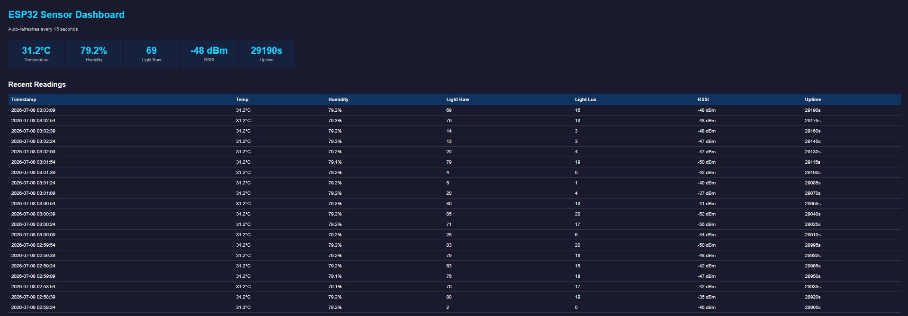

# Project 5: WiFi Sensor Node → HTTP Dashboard
| **Device:** ESP32 DevKit V1 | **Firmware:** v1.0.0 | **Device ID:** node-01

---

## Objective

Combine the DHT22 temperature/humidity sensor (Project 2) and LDR light sensor (Project 3) onto a single ESP32, post a combined JSON payload every 15 seconds to a Flask server, serve a live auto-refreshing dashboard, and prove the system stable over an 8-hour overnight soak test with automatic WiFi recovery.

---

## Circuit

Both sensors share a single breadboard. The DHT22 module (3-pin packaged) connects VCC to 3.3V, GND to GND, and OUT to GPIO 4. The LDR is wired in a voltage divider — 3.3V → LDR → midpoint → 10kΩ → GND — with GPIO 32 (ADC1) reading the midpoint voltage. GPIO 32 was chosen specifically because ADC2 pins are unusable when WiFi is active.

Three capacitors sit across the power rails. A 470µF electrolytic capacitor provides bulk decoupling. Two 100nF ceramic capacitors sit physically close to each sensor's VCC pin for local high-frequency noise filtering.

---

## The 470µF Bulk Capacitor

During WiFi transmission the ESP32 draws 300–500mA in bursts lasting 10–50ms. A USB port is rated for 500mA total but its voltage regulator cannot respond fast enough to a sudden spike. The supply voltage dips, and if it falls below ~2.7V the ESP32's internal brownout detector fires a reset — visible in Serial Monitor as "Brownout detector was triggered."

The 470µF electrolytic capacitor across 3.3V and GND acts as a local energy reservoir. Energy stored: E = ½CV² = ½ × 470µF × 3.3² = **2.56mJ**. This is enough to hold the voltage stable through the transmit burst without requiring the USB supply to react instantly.

The 100nF ceramic capacitors serve a different and complementary purpose — they filter high-frequency switching noise right at the sensor VCC pin before it can corrupt sensor readings. Bulk decoupling and local decoupling solve different problems at different frequencies; both are needed.

---

## Firmware Architecture

The firmware is structured around three dedicated functions and a state machine.

**Functions:**
- `readSensors()` — reads DHT22 temperature and humidity, takes a 16-sample average on the ADC for the LDR, checks for NaN, increments error counter on failure
- `buildPayload()` — constructs the JSON document using ArduinoJson
- `transmit()` — sends HTTP POST and returns success/failure

**State Machine:**

```
CONNECTING → ONLINE → OFFLINE_RETRY → CONNECTING → ...
```

- **CONNECTING:** Calls WiFi.begin(), waits for WL_CONNECTED, transitions to ONLINE
- **ONLINE:** Every 15 seconds reads sensors, builds payload, POSTs to server. Continuously checks WiFi.status() — on drop, transitions to OFFLINE_RETRY
- **OFFLINE_RETRY:** Calls WiFi.disconnect() then WiFi.begin() every 5 seconds. On reconnection, transitions back to ONLINE

All timing uses millis() — no delay() anywhere in the main loop. This keeps the WiFi stack running and the state machine responsive at all times.

---

## JSON Payload

Every POST carries sensor values alongside fleet metadata:

```json
{
  "device_id": "node-01",
  "fw_version": "1.0.0",
  "uptime_s": 1800,
  "rssi": -32,
  "temp": 31.2,
  "hum": 75.4,
  "light_raw": 245,
  "light_lux_approx": 59,
  "ts": 1800
}
```

`device_id` and `fw_version` identify the node and firmware in a multi-device fleet. `uptime_s` detects unexpected reboots. `rssi` tracks signal quality over time. These fields exist not for this test but because real production nodes need them.

---

## Flask Server and Dashboard

The server exposes two routes:

- **POST /readings** — validates incoming JSON, appends a timestamped row to readings.csv
- **GET /dashboard** — reads the last 20 rows from CSV and serves an HTML page with sensor value cards and a history table, auto-refreshing every 15 seconds via meta refresh

The dashboard required no ESP32 connection to view — it reads from the CSV directly, so historical data remained accessible after the soak test ended.

---

## Router Reboot Test

Mid-run, WiFi was deliberately disconnected by turning off the hotspot. The ESP32 detected disconnection either through WiFi.status() check or a failed POST, immediately transitioned to OFFLINE_RETRY, and began retrying every 5 seconds. When the hotspot was restored, the ESP32 reconnected automatically within one retry cycle and resumed posting. No manual intervention, no reboot, no data loss beyond the disconnection window.

---

## 8-Hour Soak Test Results

| Metric | Result |
|---|---|
| Test duration | 8 hours (~29,190s uptime) |
| Successful POSTs | 1934 |
| Failed POSTs | 4 |
| Sensor read errors | 1 |
| Crashes | 0 |
| Auto-recoveries | 4 |
| POST success rate | 99.79% |
| Temperature range | 29.9°C – 31.6°C |
| Humidity range | 73.2% – 80.3% |
| Light range | 0 – 285 (room lights off overnight, on in morning) |

All 4 POST failures were caused by transient hotspot instability, not firmware issues. Every failure recovered automatically. Humidity rose steadily overnight as expected in a closed room. Light values correctly tracked the room lighting cycle — low through the night, rising when lights came on in the morning.

**Dashboard screenshot (end of soak test):**



---

## Conclusion

The node ran for 8 hours without a single crash and recovered automatically from every WiFi disruption. The state machine architecture kept reconnection logic clean and explicit. The 470µF bulk capacitor eliminated brownout risk during WiFi transmit bursts. Running both sensors simultaneously on ADC1 with WiFi active produced stable, consistent readings throughout the test. All pass criteria met.